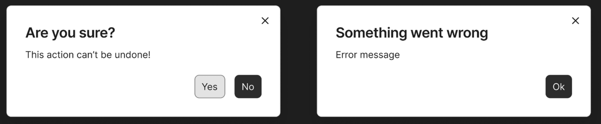

# Tooka GUI

## Overview

This repository contains a **GUI design prototype** for Tooka, created in [Figma](https://www.figma.com/design/txlP5QGsw0mmrLHOVXs6gw/Tooka?m=auto&t=dAVlITHWklvgGg9I). The design is currently **not implemented**, as I (the sole maintainer) focus on the CLI and core modules, and unfortunately don’t have the time to maintain a full GUI.

That said, the Figma design is public and available—**feel free to build it out and open a PR!** I'd be happy to review and merge contributions from the community.

## Screenshots

| Home                               | Settings                                   | Rules                                |
| ---------------------------------- | ------------------------------------------ | ------------------------------------ |
|  |  |  |

| Sorting                                  | Results                                  | Dialogs                             |
| ---------------------------------------- | ---------------------------------------- | ----------------------------------- |
|  |  |  |

---

## About This Project

Tooka is a collection of free, open-source tools maintained under a GitHub organization. The CLI and backend modules are actively maintained. While I’ve considered building a GUI, doing so would require time and effort I currently can’t spare as a full-time student working solo on this hobby project.

Still, I’ve designed a GUI concept in Figma so that the groundwork is there—either for me to revisit in the future or for anyone interested in contributing. If you're up for the challenge, fork the repo and submit a pull request. I’ll gladly review it!